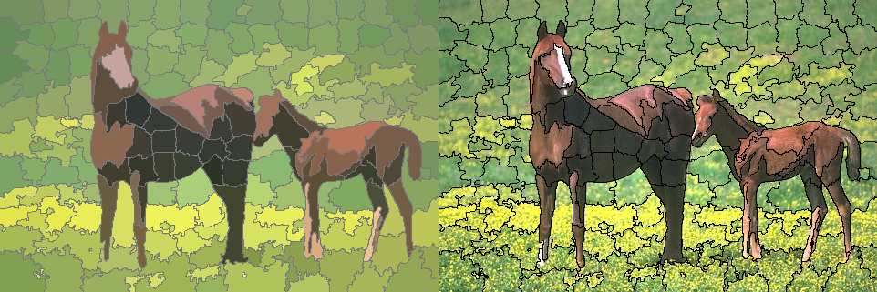

# simple_clustering
[](https://github.com/okaneco/simple_clustering)
[](https://crates.io/crates/simple_clustering)
[](https://docs.rs/simple_clustering)

Image segmentation library and command line tool using clustering methods.

Currently supported algorithms are the **SLIC** (*simple linear iterative
clustering*) and **SNIC** (*simple non-iterative clustering*) superpixel
algorithms. The crate also supports drawing basic contours around the image
segments.


To use as a library, add the following to your `Cargo.toml`. Executable builds
can be found at https://github.com/okaneco/simple_clustering/releases.

```toml
[dependencies.simple_clustering]
version = "0.2"
default-features = false
```

## Features
- image segmentation using SNIC and SLIC
- find mean colors of segmented regions
- draw contours around segment boundaries
- command line tool for generating segmented images from JPG/PNG input files

## Examples

*Images are from the [Berkeley Segmentation Dataset and Benchmark][BSD]
unless noted otherwise.*

### SNIC and SLIC

The algorithm can be selected with the `-a` option. By default, the algorithm
is `snic`.

```bash
simple_clustering -i 295087.jpg
simple_clustering -i 295087.jpg -a slic
```

---

The suggested number of superpixels to find is specified with `-k` or `-n`.
Resulting superpixel counts may be slightly greater or less than this value due
to characteristics of seeding or enforcing connectivity of superpixel labels.
The default setting is `1000`.

```bash
simple_clustering -i 295087.jpg -k 200
```

---

The `-m` option is used to control the "compactness" of each superpixel. The
number ranges from `1` to `20` with a tradeoff between uniform superpixel size
and better boundary adherence. `1` will result in larger and more non-uniform
superpixels while `20` will result in more compact and uniform superpixels. By
default, `-m` is set to `10`.

```bash
simple_clustering -i 55067.jpg -m 1
simple_clustering -i 55067.jpg -m 20
```


*Left image: `-m 1`. Right image: `-m 20`.*

---

### Contours

The segment color defaults to black, `#000`, but can be specified with the
`--segment-color` option followed by a 3 or 6 digit hexadecimal RGB color. The
following example sets the color to gray, `#777`. To save the segment contours
over the original image data, add the `--no-mean` flag to skip generating the
mean color image.

```bash
simple_clustering -i 113016.jpg -k 200 --segments --segment-color 777
simple_clustering -i 113016.jpg -k 200 --segments --no-mean
```


*Left image: Segmented image with gray contours. Right image: Superpixel regions
drawn over original image data.*

---

### Reference

*Achanta, R., Shaji, A., Smith, K., Lucchi, A., Fua, P., & Süsstrunk, S. SLIC
Superpixels. EPFL Technical Report no. 149300, June 2010.*

*Achanta, R., Shaji, A., Smith, K., Lucchi, A., Fua, P., & Süsstrunk, S. SLIC
Superpixels Compared to State-of-the-art Superpixel Methods. IEEE Transactions
on Pattern Analysis and Machine Intelligence, vol. 34, num. 11, p. 2274 – 2282,
May 2012.*

*Achanta, R., & Süsstrunk, S. Superpixels and polygons using simple
non-iterative clustering. Proceedings of the IEEE Conference on Computer Vision
and Pattern Recognition, 2017.*

*Martin, D., Fowlkes, C., Tal, D., & Malik, J. A Database of Human Segmented
Natural Images and its Application to Evaluating Segmentation Algorithms and
Measuring Ecological Statistics. Proc. 8th Int'l Conf. Computer Vision, vol. 2,
p. 416 – 423, July 2001.*

## License
This crate is licensed under either
- the [MIT License](LICENSE-MIT), or
- the [Apache License (Version 2.0)](LICENSE-APACHE)

at your option.

Unless you explicitly state otherwise, any contribution intentionally submitted
for inclusion in the work by you, as defined in the Apache-2.0 license, shall be
dual licensed as above, without any additional terms or conditions.

[BSD]: https://www2.eecs.berkeley.edu/Research/Projects/CS/vision/bsds/
